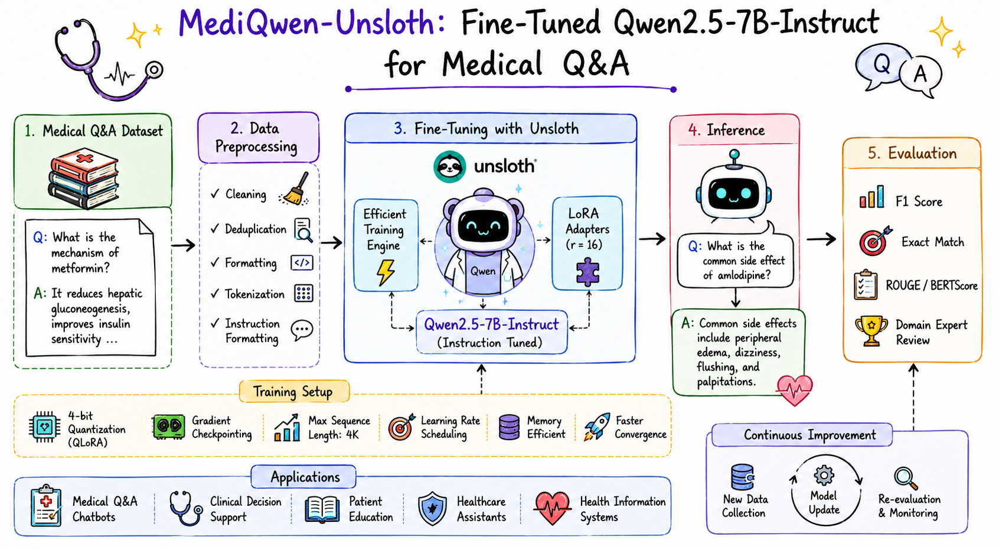
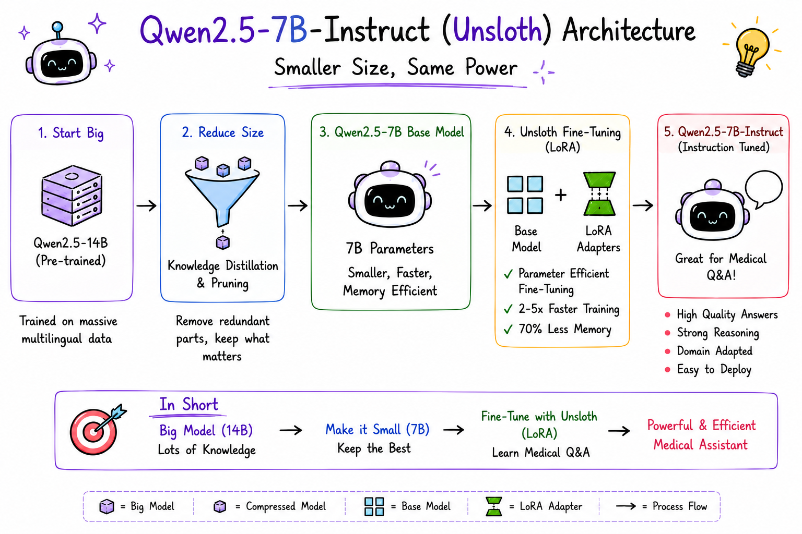

# MedAssist-Qwen

### Efficient Fine-Tuning of Qwen2.5-7B-Instruct for Medical Question Answering using Unsloth

<p align="center">
  
</p>

<h1 align="center">🩺 Unsloth-MediQwen</h1>

<h3 align="center">
Fine-Tuning Qwen2.5-7B-Instruct for Medical Question Answering using Unsloth
</h3>

<p align="center">
  
  
  
  
  
  
</p>

---

# Overview

**Unsloth-MediQwen** is a domain-specific Medical Question Answering (Medical QA) model developed by fine-tuning **Qwen2.5-7B-Instruct** on a **Medical Question & Answer Dataset** using **Unsloth**. The project demonstrates how a powerful instruction-tuned Large Language Model can be efficiently adapted for healthcare applications while achieving faster training, reduced GPU memory consumption, and high-quality medical response generation.

---

# Features

* Medical Question Answering
* Fine-tuned Qwen2.5-7B-Instruct
* Efficient Fine-Tuning with Unsloth
* LoRA-based Parameter-Efficient Training
* Medical Instruction Dataset
* Memory-Efficient Training
* Context-Aware Medical Responses
* Ready for Inference & Deployment
* Easily Extendable for Healthcare AI Research

---

# Model Architecture

<p align="center">
  
</p>

---

# Technology Stack

* Python
* PyTorch
* Hugging Face Transformers
* Unsloth
* TRL
* Accelerate
* BitsAndBytes
* Datasets
* PEFT (LoRA)

---

# Dataset

The model is fine-tuned on a **Medical Question & Answer Dataset** consisting of healthcare-related questions paired with expert-style answers. The dataset is formatted for instruction tuning, enabling the model to generate informative, context-aware, and clinically relevant responses.

### Example

**Input**

```text
What are the symptoms of asthma?
```

**Output**

```text
Common symptoms include wheezing, shortness of breath,
chest tightness, persistent coughing, and fatigue.
```

---

# Applications

* Medical Question Answering
* AI Healthcare Assistants
* Patient Education
* Clinical Knowledge Support
* Medical Information Retrieval
* Healthcare Research
* Educational Medical Chatbots

---

# Model Efficiency

**Qwen2.5-7B-Instruct**, combined with **Unsloth**, enables highly efficient fine-tuning through optimized kernels, 4-bit quantization, and parameter-efficient adaptation. This significantly reduces GPU memory usage while maintaining strong reasoning capabilities, making the model suitable for consumer GPUs and rapid experimentation.

### Benefits

* Faster Fine-Tuning
* Lower GPU Memory Usage
* Efficient LoRA Training
* 4-bit Quantization Support
* Faster Inference
* High-Quality Medical Responses

---

# Future Work

* 🔹 Retrieval-Augmented Generation (RAG) for evidence-based medical responses
* 🔹 Multi-turn Clinical Conversations
* 🔹 Medical Report & Clinical Note Question Answering
* 🔹 Integration with Electronic Health Records (EHR)
* 🔹 FastAPI REST API Deployment
* 🔹 Hugging Face Spaces Demo
* 🔹 GGUF & ONNX Export for Edge Deployment
* 🔹 Quantization for Mobile and Embedded Devices

---


# Why Qwen2.5 + Unsloth?

Fine-tuning Large Language Models often requires powerful GPUs and significant memory resources, making domain-specific adaptation difficult on consumer hardware.

This project demonstrates that **Qwen2.5-7B-Instruct**, combined with **Unsloth**, can be fine-tuned efficiently for Medical Question Answering while reducing GPU memory usage and maintaining high-quality, context-aware responses.

### Highlights

* Memory-efficient fine-tuning
* Faster training with Unsloth
* LoRA-based parameter-efficient adaptation
* Lower GPU memory requirements
* Accurate medical question answering
* Ready for real-world deployment

This repository showcases an efficient workflow for adapting Qwen2.5-7B-Instruct to the medical domain using Unsloth, enabling faster training, lower memory consumption, and reliable Medical Question Answering on consumer-grade GPUs.
